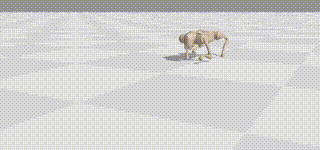
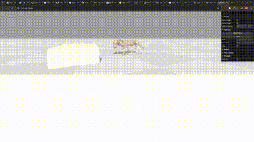

# Model-based Diffusion for Legged Robot Locomotion Playground

## What is this?

This is a minimal implementation of model-based diffusion for go2 robot control. 

You can run the code with 

```bash
python mbd_core.py
```

Then you will see the visualization of the robot walking from the URL:




## What to explore?

To understand the code, I'd encourage you to add a obstacle to the environment and let the robot learn to jump on the top of it. 

1. try to add an obstacle to the environment. you can visualize the updated environment by running `python go2_env.py`
2. try to change the reward of the environment such that the robot can jump on top of the obstacle. 

